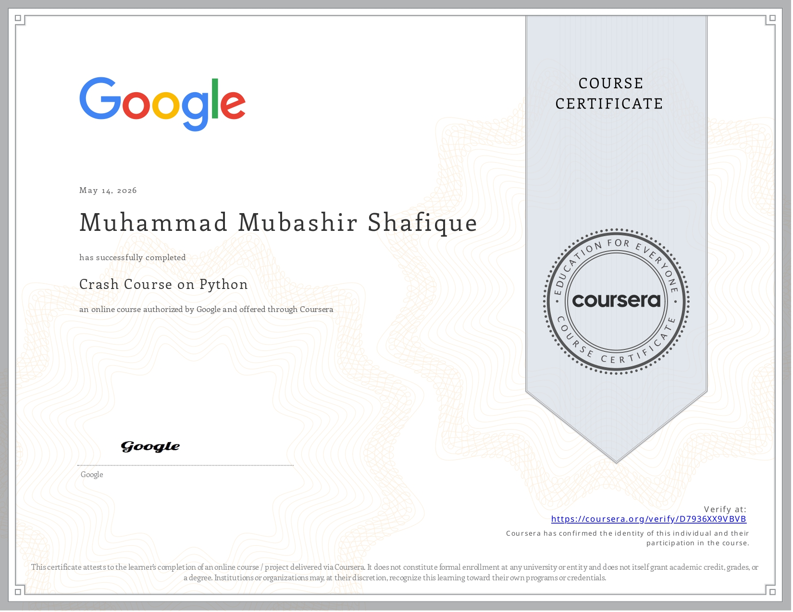
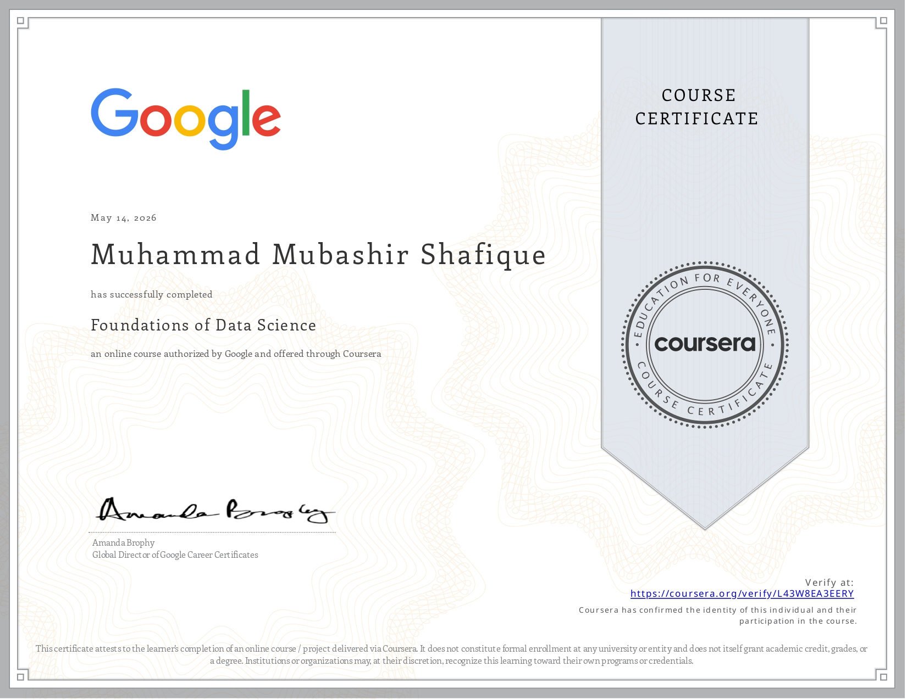

#  Skill Validation & Professional Certifications

While I have already developed various projects, I believe in continuous learning and professional growth. This repository serves as a record of my efforts to **validate my existing skills**, **revise core concepts**, and align my knowledge with industry standards through globally recognized certifications.

---

## Featured Certifications

### 1. Crash Course on Python 
**Authorized by:** Google | **Platform:** Coursera

Having used Python in multiple projects, I took this course to **formally validate my expertise** and perform a deep-dive revision of Object-Oriented Programming (OOP). It helped me refine my coding practices and ensure my technical foundation is solid according to Google's standards.

[🔗 Verify Credential](https://coursera.org/verify/D7936XX9VBVB)

---

### 2. Foundations of Data Science 
**Authorized by:** Google | **Platform:** Coursera

This certification was completed to **standardize my understanding** of the Data Science lifecycle. Even with prior project experience, this course helped me bridge any theoretical gaps and formalize my approach toward data-driven decision-making and professional analytics.

[🔗 Verify Credential](https://coursera.org/verify/L43W8EA3EERY)

---

## Summary Table

| Course Name | Platform | Goal | Verification Link |
| :--- | :--- | :--- | :--- |
| **Crash Course on Python** | Google / Coursera | Skill Validation & OOP Revision | [View Credential](https://coursera.org/verify/D7936XX9VBVB) |
| **Foundations of Data Science** | Google / Coursera | Industry Standardization | [View Credential](https://coursera.org/verify/L43W8EA3EERY) |

---

### Connect with me
To see these skills in action, feel free to explore my **Projects Repository** or reach out for a technical discussion!
